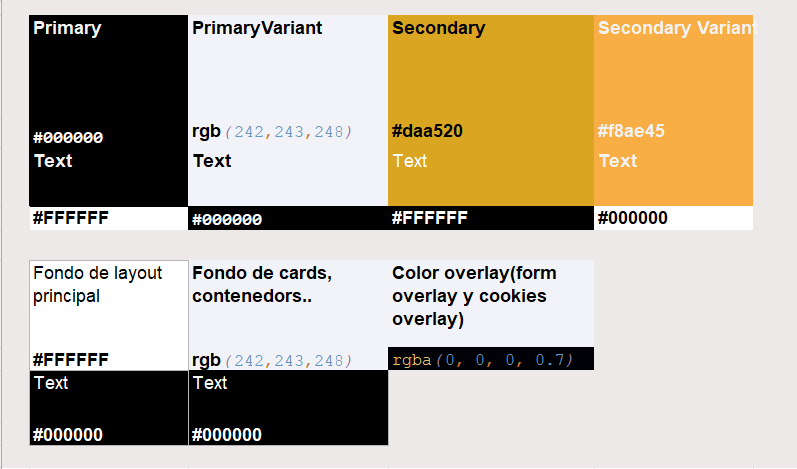
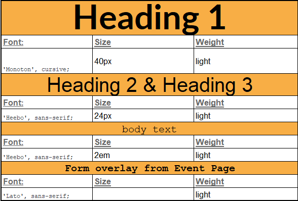

<h1>TimeInn</h1>

## Tabla de contenidos:
---
- [Descripción y contexto](#descripción-y-contexto)
- [Guía de usuario](#guía-de-usuario)
- [Dificultades del proyecto](#Dificultades-del-proyecto)
- [Mejoras del proyecto](#Mejoras-proyecto)
- [Wireframe](#WireFrame)
- [color_font_pallete](#Color-and-font-pallete)  
- [Paginas_web_inspiradas](#Paginas-web-inspiradas)
- [Video](#Video)
- [Autor/es](#autores)

## Descripción y contexto
---

## Guía de usuario
---
**Funcionalidades:**

 

- Posibilidad de escribir como si fuera un mobil al hacer click en cada botón.
- 
Con esta tecla se borra todo: 

- 
 Con está tecla borras la ultima palabra cada vez que haces click encima de la tecla

- 
 Con está tecla borras la última letra

- 
 Con está tecla borras la primera letra

- 
 Con está tecla creas un salto de linea que posteriormente se visualizará cuando se envie

    -Así se visualiza en el input:
    

 
    -Así se visualiza en el apartado de mensajes:
    

 
- 
 Con está tecla cambiamos de minusculas a mayusculas con un click y con dos clicks cambia a mayusculas permanentes

## Dificultades del proyecto
---
**Entre otras dificultades que me he encontrado son las siguientes:**
*Css*
- 
- 

*JavaScript*
- 
- 
- 

## Mejoras del proyecto
---
-

## WireFrame

El enlace de nuestro wireframe es el siguiente: https://balsamiq.cloud/sb1o4bb/pa31lcr

## Color and font Pallete

- La paleta de colores utilizadas es la siguiente:

- La paleta de las fuentes de escritura es la siguiente, la paleta utiliza google font para añadir estilos que no tenemos:

##Paginas web Inspiradas

##Video

## Autor/es

- Maite Ladaria Sanchez
- Ignacio Akrich Vazquez
